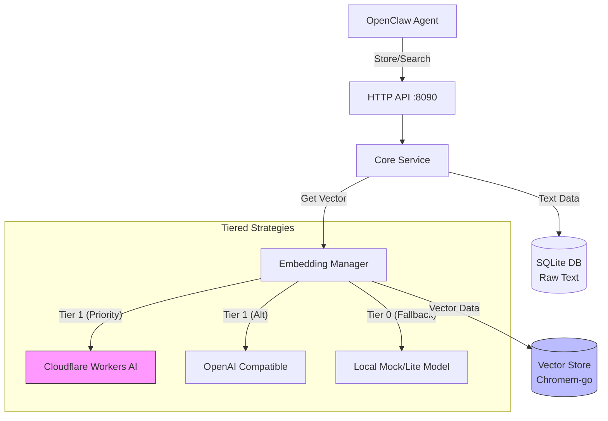

# ClawMem 🦞

**The "Sovereign Memory" for Low-Cost AI Agents.**

[](https://opensource.org/licenses/MIT)
[](https://goreportcard.com/report/github.com/xiaotiyanlove-star/clawmem)

[🇨🇳 中文文档 (Chinese Documentation)](README_CN.md)

---

### 💡 Why ClawMem?

Running a smart AI Agent usually requires a **Vector Database** and an **Embedding Model**. But for personal agents running on **cheap VPS ($5/mo)**, this is a nightmare:

*   ❌ **Heavy**: Docker containers and Python-based vector DBs eat up RAM (500MB+).
*   ❌ **Slow**: Running local embedding models on a weak CPU makes the agent unresponsive.
*   ❌ **Complex**: You spend more time managing infrastructure than building your agent.

**ClawMem** is designed to be the **lightest, most resilient memory layer** for your sovereign AI agent.

### ✨ Key Benefits

1.  **💸 Token Efficiency (Huge Cost Saver)**:
    *   Without Memory: You must feed the *entire* chat history to the LLM context window. Expensive & slow.
    *   **With ClawMem**: Retrieve only the *top 3 relevant memories*. Keep your context window small, fast, and cheap.
2.  **💰 Zero Infra Cost**: Use **Cloudflare Workers AI (Free Tier)** for GPT-4 level semantic understanding.
3.  **🪶 Featherlight**: Pure Go. No Docker/Python. Binary is **~15MB**, RAM usage **<20MB**.
4.  **🛡️ Bulletproof Resilience**:
    *   **Cloud Down?** Automatically falls back to local models.
    *   **Rate Limit?** Degrades gracefully without crashing.

---

## 🏗️ Architecture



---

## ⚡ One-Click Deployment

If you have `root` access and `go` installed:

```bash
git clone https://github.com/xiaotiyanlove-star/clawmem
cd clawmem
sudo ./scripts/install.sh
```

**The script will interactively ask for:**
*   Service Port (Default: `8090`)
*   Database Path (Default: `/var/lib/clawmem/...`)
*   Cloudflare Credentials (Account ID & Token)

It automatically compiles the binary and configures the systemd service.

---

## 🔧 Configuration Reference

Configuration is stored in `/etc/clawmem/config.env`.

### Core Settings
| Variable | Default | Description |
| :--- | :--- | :--- |
| `PORT` | `8090` | The HTTP port the service listens on. |
| `DB_PATH` | `/var/lib/clawmem/clawmem.db` | SQLite file path for storing raw memory text and metadata. |
| `VECTOR_DB_PATH` | `/var/lib/clawmem/vectors` | Directory path for storing vector indices. |

### Embedding Strategy
| Variable | Default | Description |
| :--- | :--- | :--- |
| `EMBEDDING_STRATEGY` | `cloud_first` | `cloud_first`: Try Cloudflare/OpenAI -> Fallback to Local.<br>`local_only`: Never call external APIs.<br>`accuracy_first`: Try OpenAI -> Cloudflare -> Local. |

### Providers
| Variable | Description |
| :--- | :--- |
| `CF_ACCOUNT_ID` | **Cloudflare Account ID**. Found in Workers & Pages overview. |
| `CF_API_TOKEN` | **Cloudflare API Token**. Must have `Workers AI (Read)` permissions. |
| `EMBED_API_BASE` | (Optional) OpenAI-compatible embedding endpoint. |
| `EMBED_API_KEY` | (Optional) Key for the above endpoint. |

### Advanced
| Variable | Default | Description |
| :--- | :--- | :--- |
| `DISABLE_LLM_SUMMARY` | `true` | If `false`, uses LLM to summarize long memories before storage (requires LLM config). |

---

## 🔌 OpenClaw Integration

We recommend using the **Skill Mode** to integrate with OpenClaw without modifying the core configuration.

### Setup

1.  Copy the `skills/clawmem` directory to your OpenClaw skills folder.
2.  Install python dependencies: `pip install requests`.

### Usage in Agent

The agent can now use natural language to store and retrieve memories:

*   **Store**: "Remember that the server IP is 1.2.3.4" -> Calls `clawmem add`.
*   **Recall**: "What was the server IP?" -> Calls `clawmem search`.

## 📄 License

MIT License. See [LICENSE](LICENSE) file.

## Acknowledgements

This project **references and draws inspiration from the architectural design of [MemOS](https://github.com/MemTensor/MemOS)** (GitHub - MemTensor/MemOS: AI memory OS for LLM and Agent systems(moltbot,clawdbot,openclaw), enablin).

MemOS is an excellent LLM memory operating system.

ClawMem is a lightweight implementation and adaptation based on MemOS design philosophy, customized for the OpenClaw agent ecosystem.

Thanks to the MemTensor team for their outstanding work.
