# ClawMem 🦞

**The "Sovereign Memory" for Low-Cost AI Agents.**

[](https://opensource.org/licenses/MIT)
[](https://goreportcard.com/report/github.com/xiaotiyanlove-star/clawmem)
[](go.mod)

[🇨🇳 中文文档](README_CN.md)

---

## 💡 Why ClawMem?

Running a smart AI Agent usually requires a **Vector Database** and an **Embedding Model**. But for personal agents running on **cheap VPS ($5/mo)**, this is a nightmare:

| Pain Point | Without ClawMem | With ClawMem |
| :--- | :--- | :--- |
| **Memory** | Docker + Python vector DB eat 500MB+ RAM | Pure Go binary, **<20MB** RAM |
| **Cost** | Pay for OpenAI embeddings on every request | **Free** Cloudflare Workers AI embeddings |
| **Token Usage** | Feed entire chat history to LLM context | Retrieve only **top-K relevant memories** |
| **Resilience** | Single point of failure | Auto-fallback across 3 tiers |
| **Deployment** | Docker Compose, Python, pip, venv... | **Single binary**, zero dependencies |

**ClawMem** is designed to be the **lightest, most resilient memory layer** for your sovereign AI agent.

---

## ✨ Key Features

- 🪶 **Featherlight** — Pure Go, statically compiled. Single binary **~15MB**, memory usage **<20MB**. Runs on the cheapest VPS.
- 💰 **Zero Cost Embeddings** — Cloudflare Workers AI free tier provides high-quality semantic understanding at no cost.
- 🛡️ **Isolation & Security** — Native support for tenant-level physical isolation via `user_id`. Built-in `AUTH_TOKEN` authentication and protection against SSRF/Over-Payload attacks.
- ⚡ **High Concurrency & Caching** — Built-in SQLite semantic cache, refactored with a **Go-Channel async batch write queue** to solve high-frequency concurrency locks.
- 🔌 **Omnipotent MCP Protocol** — Built-in MCP Server providing a full suite of Agent memory tools: `add_memory`, `search_memory`, `set_memory`, `delete_memory`, `get_preferences`.
- 💤 **Dream Engine** — Background auto-consolidation of memories via structured JSON. It not only extracts summaries but automatically resolves user preference conflicts via a `supersedes` mechanism.
- 📊 **Visual Dashboard** — Real-time `/dashboard` provides a static, beautiful memory usage alert screen and health monitoring without any frontend dependencies.
- 🛠️ **Self-Healing** — Background auto-upgrade of "local dialect" vectors to high-quality cloud embeddings once network restores. No more "ghost data".

---

## 🏗️ Architecture

```mermaid
graph TD
    User[OpenClaw / MCP Client] -->|Store / Search| API[HTTP API :8090]
    User -->|MCP Protocol| MCP[MCP Server :stdio]
    API --> Service[Core Service]
    MCP --> Service
    Service -->|Text Data| SQLite[(SQLite DB<br/>Raw Text + Cache)]
    Service -->|Get Vector| Manager[Embedding Manager]
    
    Dream[💤 Dream Engine<br/>Background Task] -.->|Read/Compress| SQLite
    Dream -.->|Store Consolidated| Service
    Dream -.->|Generate| LLM[🧠 LLM Provider]

    Healer[🛠️ Healer<br/>Self-Healing Task] -.->|Upgrade Local Vectors| Manager
    Healer -.->|Update Cache| SQLite
    
    subgraph "Multi-Tier Embedding Strategy"
        Manager -->|"Tier 1 · Priority"| CF[☁️ Cloudflare Workers AI<br/>Free · Fast]
        Manager -->|"Tier 1 · Alternate"| OA[🤖 OpenAI Compatible<br/>SiliconFlow etc.]
        Manager -->|"Tier 0 · Fallback"| Local[💻 Local BERT<br/>Lazy Loaded · Offline]
    end
    
    Manager -->|Vector Data| VectorDB[(Chromem-go<br/>Vector Store)]
    
    style CF fill:#f9f,stroke:#333
    style OA fill:#ffc,stroke:#333
    style Local fill:#cfc,stroke:#333
    style VectorDB fill:#bbf,stroke:#333
    style Dream fill:#fcf,stroke:#333,stroke-dasharray: 5 5
    style Healer fill:#cef,stroke:#333,stroke-dasharray: 5 5
    style LLM fill:#ff9,stroke:#333
```



---

## ⚡ Quick Start

### Option 1: Download Pre-built Binary

Download the latest alpha release from [GitHub Releases](https://github.com/xiaotiyanlove-star/clawmem/releases).

```bash
# Linux (amd64)
chmod +x clawmem-linux-amd64
./clawmem-linux-amd64

# macOS (Apple Silicon)
chmod +x clawmem-darwin-arm64
./clawmem-darwin-arm64
```

### Option 2: Build from Source

```bash
git clone https://github.com/xiaotiyanlove-star/clawmem.git
cd clawmem
CGO_ENABLED=0 go build -o clawmem ./cmd/server/
./clawmem
```

### Option 3: One-Click Server Deployment

```bash
git clone https://github.com/xiaotiyanlove-star/clawmem
cd clawmem
sudo ./scripts/install.sh
```

The script will interactively configure the service port, database paths, and Cloudflare credentials, then automatically compile and register a `systemd` service.

---

## 🔧 Configuration

Configuration is done via environment variables or a `.env` file. See [`.env.example`](.env.example) for a complete template.

### Core

| Variable | Default | Description |
| :--- | :--- | :--- |
| `PORT` | `8090` | HTTP API listening port |
| `AUTH_TOKEN` | — | *(Highly Recommended)* Validation key for API requests and Dashboard. Without this, your API is fully exposed. |
| `DB_PATH` | `data/clawmem.db` | SQLite database path (raw text + embedding cache) |
| `VECTOR_DB_PATH` | `data/vectors` | Chromem-go vector index directory |
| `MAX_MEMORY_COUNT` | `5000` | Global memory threshold. Memories exceeding this will trigger aggressive access-rate depreciation. |

### Embedding Strategy

| Variable | Default | Description |
| :--- | :--- | :--- |
| `EMBEDDING_STRATEGY` | `cloud_first` | Embedding provider selection strategy |

Available strategies:

| Strategy | Behavior |
| :--- | :--- |
| `cloud_first` | Cloudflare → Local fallback **(Recommended)** |
| `accuracy_first` | OpenAI → Cloudflare → Local |
| `local_only` | Local model only, never calls external APIs |

### Provider Credentials

| Variable | Description |
| :--- | :--- |
| `CF_ACCOUNT_ID` | Cloudflare Account ID (Workers & Pages overview) |
| `CF_API_TOKEN` | Cloudflare API Token (requires `Workers AI Read` permission) |
| `EMBED_API_BASE` | *(Optional)* OpenAI-compatible embedding endpoint URL |
| `EMBED_API_KEY` | *(Optional)* API key for the above endpoint |

### LLM (Optional)

| Variable | Default | Description |
| :--- | :--- | :--- |
| `LLM_API_BASE` | — | LLM API endpoint for memory summarization |
| `LLM_API_KEY` | — | LLM API key |
| `LLM_MODEL` | `gpt-4o-mini` | Model name |
| `DISABLE_LLM_SUMMARY` | `true` | Set to `false` to enable LLM-powered memory summarization |

### 🌙 Dream (Memory Consolidation)

Dream is an optional background process that periodically consolidates fragmented memories into concise, high-quality entries — like how the human brain organizes memories during sleep.

**Disabled by default.** Set `DREAM_ENABLED=true` to activate. When disabled, Dream has zero impact on existing functionality.

| Variable | Default | Description |
| :--- | :--- | :--- |
| `DREAM_ENABLED` | `false` | Enable the Dream memory consolidation feature. |
| `DREAM_INTERVAL` | `24h` | How often to run consolidation (e.g., `12h`, `6h`, `24h`). |
| `DREAM_WINDOW` | `24h` | Time window to look back for memories to consolidate. |
| `DREAM_MIN_COUNT` | `10` | Minimum number of memories required to trigger a cycle (avoids wasting tokens on quiet days). |
| `DREAM_MAX_ITEMS` | `200` | Maximum memories to process per cycle (prevents token explosion). |
| `DREAM_LLM_BASE` | *(uses `LLM_API_BASE`)* | Override LLM endpoint for Dream (e.g., use a cheaper model). |
| `DREAM_LLM_KEY` | *(uses `LLM_API_KEY`)* | Override LLM API key for Dream. |
| `DREAM_LLM_MODEL` | *(uses `LLM_MODEL`)* | Override LLM model for Dream (e.g., `gemini-2.0-flash`). |
| `DREAM_PROMPT` | *(built-in)* | Custom system prompt for the consolidation LLM call. |

#### How Dream Works

```
┌─────────────────────────────────────────────────────┐
│  Every DREAM_INTERVAL (e.g., 24h)                   │
│                                                     │
│  1. Fetch active memories from last DREAM_WINDOW    │
│  2. Skip if count < DREAM_MIN_COUNT                 │
│  3. Send to LLM: "Consolidate these fragments"      │
│  4. LLM returns concise facts (conflict-resolved)   │
│  5. Store new "dream" memories (tagged, searchable)  │
│  6. Mark originals as "consolidated" (soft archive)  │
└─────────────────────────────────────────────────────┘
```

**What Dream solves:**
- **Memory conflicts**: If you said "I like A" yesterday and "I hate A" today, Dream keeps only the latest preference.
- **Noise accumulation**: 500 chat fragments → 5 concise facts. Dramatically improves retrieval quality.
- **Token waste**: Smaller, cleaner memory = cheaper and more accurate LLM responses.

#### Manual Trigger

You can trigger a Dream cycle at any time via the API:

```bash
curl -X POST http://localhost:8090/api/v1/dream/trigger
```

#### Example

**Before Dream** (raw fragments):
```
[1] "好的，我知道了"
[2] "服务器 IP 是 1.2.3.4"
[3] "嗯嗯"
[4] "把端口改成 8080"
[5] "之前说的 IP 不对，应该是 5.6.7.8"
[6] "收到"
```

**After Dream** (consolidated):
```
- Server IP: 5.6.7.8 (updated from 1.2.3.4)
- Server port: 8080
```

6 fragments → 2 facts. Clean, conflict-resolved, and searchable.

---

## 📡 API Reference

## 📡 API Reference

*(If `AUTH_TOKEN` is configured, include `X-API-KEY: <token>` or `Authorization: Bearer <token>` in headers)*

### Store / Set a Memory

```bash
# Intelligently overwrite or store (recommended for AI Agents)
curl -X POST http://localhost:8090/api/v1/memo/set \
  -H "X-API-KEY: your_auth_token" \
  -H "Content-Type: application/json" \
  -d '{
    "user_id": "user-001",
    "kind": "fact",
    "content": "The server IP address is 192.168.1.100"
  }'

# Raw simple append
curl -X POST http://localhost:8090/api/v1/memo \
  -H "X-API-KEY: your_auth_token" \
  -H "Content-Type: application/json" \
  -d '{
    "user_id": "user-001",
    "kind": "conversation",
    "content": "I want to deploy a Golang backend."
  }'
```

### Search Memories

```bash
# Finds most relevant memories across tiers (preferences first)
curl -H "X-API-KEY: your_auth_token" "http://localhost:8090/api/v1/memo/search?user_id=user-001&query=server+IP&top_k=5"
```

### Visual Dashboard

Start the server and visit the dashboard in your browser to view the real-time memory stats:
```
http://localhost:8090/dashboard
```

### Soft Delete Memories

```bash
# Delete by specific ID
curl -X DELETE -H "X-API-KEY: your_auth_token" "http://localhost:8090/api/v1/memo/{id}"

# Batch semantic deletion
curl -X POST http://localhost:8090/api/v1/memo/delete-by-query \
  -H "X-API-KEY: your_auth_token" \
  -H "Content-Type: application/json" \
  -d '{
    "user_id": "user-001",
    "query": "forget about the old deploy script"
  }'
```

### Health Check

```bash
curl http://localhost:8090/health
```

---

## 🔌 Integration

### MCP Server (Claude Desktop / OpenClaw)

ClawMem includes a built-in MCP server binary (`clawmem-mcp`) for seamless integration with MCP-compatible clients. It exposes 5 core tenant-isolated tools:

- `add_memory`: Traditional append-only storage.
- `search_memory`: Semantic retrieval tool.
- `set_memory`: Overwrite specific facts intelligently.
- `get_preferences`: Extract high-priority preference rules.
- `delete_memory`: Erase a specific memory fragment.

```json
{
  "mcpServers": {
    "clawmem": {
      "command": "/path/to/clawmem-mcp",
      "args": [],
      "env": {
        "CLAWMEM_URL": "http://localhost:8090"
      }
    }
  }
}
```

### OpenClaw Skill Mode

1. Copy the `skills/clawmem` directory to your OpenClaw skills folder.
2. Install dependencies: `pip install requests`.
3. Your agent can now say: *"Remember that the server IP is 1.2.3.4"* → Automatically stored via ClawMem.

---

## 🗺️ Roadmap

- [x] Multi-tier embedding with automatic fallback
- [x] SQLite semantic caching with partial cache hit diffing
- [x] Batch embedding support
- [x] MCP protocol server
- [x] Lazy loading for local models
- [x] Startup health checks
- [x] Self-Healing mechanism for offline fallbacks
- **[x] v0.3 Tiered Memory Architecture (Fact/Preference/Summary)**
- **[x] v0.3 Smart Upsert (Set API) with Conflict Resolution**
- **[x] v0.3 Tenant/Session Physical Isolation (`user_id`)**
- **[x] v0.3 Automated Decay, Max Budget and Cycle Management**
- [ ] ONNX Runtime integration for quantized local inference (Int8)

---

## 📄 License

This project is licensed under the [MIT License](LICENSE).

---

## 🙏 Acknowledgements

This project **references and draws inspiration from the architectural design of [MemOS](https://github.com/MemTensor/MemOS)** — an excellent AI memory operating system for LLM and Agent systems.

ClawMem is a lightweight implementation and adaptation based on **MemOS design philosophy**, customized specifically for the **OpenClaw agent ecosystem**.

Thanks to the **MemTensor team** for their outstanding work. 🫡
