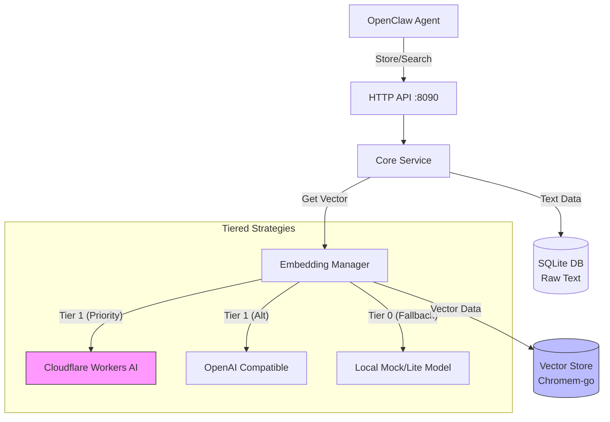

# ClawMem (MemOS-Go)

轻量级、高性能、低成本的 AI 记忆后端，使用 Go 重写。

## 架构概览

## 核心特性

- **极致轻量**: Cloud 模式下内存占用 <30MB，单文件部署。
- **降本增效**: 优先使用 Cloudflare Workers AI (免费)，支持 OpenAI/SiliconFlow 付费备用。
- **高可用**: 自动降级策略，断网自动切换本地模型。
- **智能缓存**: 内置语义缓存 (SQLite)，重复内容零开销。
- **性能优化**: 支持批量 Embedding，精细化并发控制。

## 快速开始

1. 下载 [Release](https://github.com/xiaotiyanlove-star/clawmem/releases) 二进制文件。
2. 配置 `.env` 文件（参考 `.env.example`）。
3. 运行 `./clawmem`。

更多详情请参考 [walkthrough.md](walkthrough.md) (需结合 artifacts 使用)。

## 致谢

本项目**参考并借鉴了 [MemOS](https://github.com/MemTensor/MemOS)** （GitHub - MemTensor/MemOS: AI memory OS for LLM and Agent systems(moltbot,clawdbot,openclaw), enablin）的架构设计。

MemOS 是一个非常优秀的 LLM 记忆操作系统。

ClawMem 是基于 MemOS 设计思想的轻量化实现与适配，
专为 OpenClaw 智能体生态定制。

感谢 MemTensor 团队的杰出工作。
