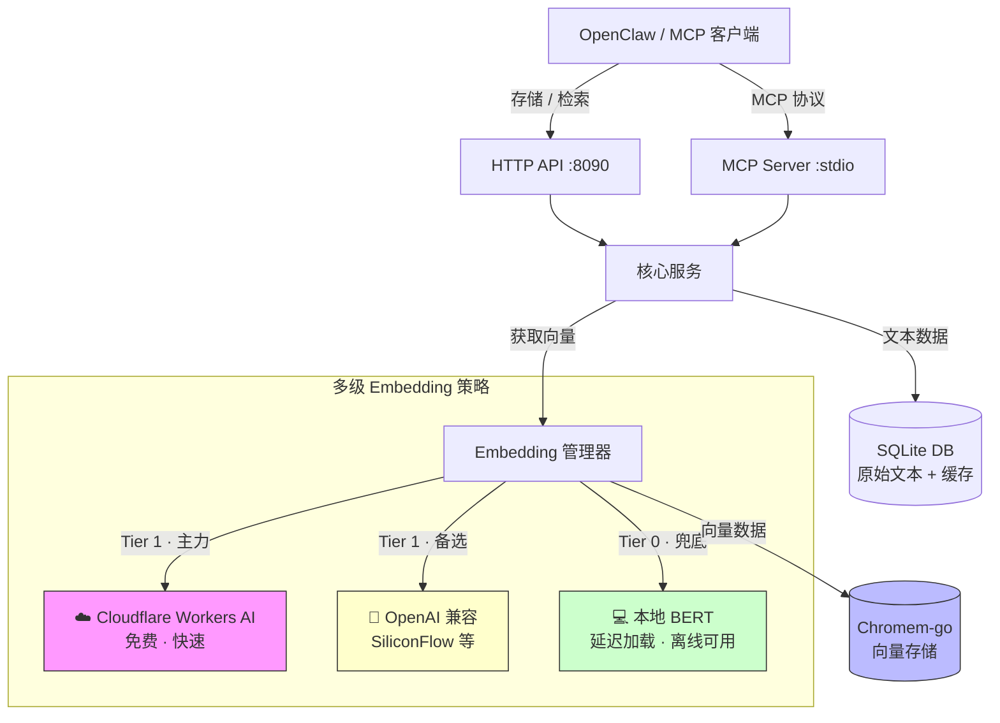

# ClawMem 🦞

**低成本 AI Agent 的「主权记忆层」。**

[](https://opensource.org/licenses/MIT)
[](https://goreportcard.com/report/github.com/xiaotiyanlove-star/clawmem)
[](go.mod)

[🇬🇧 English Documentation](README.md)

---

## 💡 为什么需要 ClawMem？

通常，要让 AI Agent 拥有长期记忆，你需要部署一个 **向量数据库** 和一个 **Embedding 模型**。但对于运行在 **廉价 VPS ($5/月)** 上的个人 Agent 来说，这简直是灾难：

| 痛点 | 没有 ClawMem | 有了 ClawMem |
| :--- | :--- | :--- |
| **内存占用** | Docker + Python 向量库吃掉 500MB+ | 纯 Go 二进制，**<20MB** 内存 |
| **使用成本** | 每次请求都要付费调 OpenAI Embedding | **免费** Cloudflare Workers AI |
| **Token 消耗** | 每次对话都要把完整历史塞进上下文 | 只检索 **Top-K 条相关记忆** |
| **容错能力** | 单点故障，挂了就挂了 | 三层自动降级，永不崩溃 |
| **部署方式** | Docker Compose, Python, pip, venv... | **单文件**，零依赖 |

**ClawMem** 是专为低配、主权级 AI Agent 设计的**极轻量、高韧性记忆层**。

---

## ✨ 核心特性

- 🪶 **极致轻量** — 纯 Go 编写，静态编译。单文件约 **~15MB**，运行时内存 **<20MB**。最便宜的 VPS 也能跑。
- 💰 **零成本 Embedding** — 优先使用 Cloudflare Workers AI 免费层，提供高质量语义理解，无需花一分钱。
- 🛡️ **究极稳健** — 三层自动降级策略：Cloudflare → OpenAI 兼容 → 本地模型。断网不崩溃，限流不报错。
- ⚡ **智能缓存** — 内置 SQLite 语义缓存，支持部分缓存命中（差量计算）。重复文本 = 零 API 调用。
- 🔄 **批量处理** — 原生支持批量 Embedding，最大限度减少 HTTP 往返次数。
- 🔌 **MCP 协议** — 内置 MCP Server，可无缝接入 Claude Desktop、OpenClaw 等 MCP 客户端。
- 🧠 **延迟加载** — 本地模型按需加载，Cloud 模式下保持极低内存占用。
- 🏥 **启动自检** — 启动时自动检测 API 可用性，不可用的 Provider 立即标记为 DOWN，避免运行时超时。

---

## 🏗️ 架构概览



---

## ⚡ 快速开始

### 方式一：下载预编译二进制

前往 [GitHub Releases](https://github.com/xiaotiyanlove-star/clawmem/releases) 下载最新的 Alpha 版本。

```bash
# Linux (amd64)
chmod +x clawmem-linux-amd64
./clawmem-linux-amd64

# macOS (Apple Silicon)
chmod +x clawmem-darwin-arm64
./clawmem-darwin-arm64
```

### 方式二：从源码编译

```bash
git clone https://github.com/xiaotiyanlove-star/clawmem.git
cd clawmem
CGO_ENABLED=0 go build -o clawmem ./cmd/server/
./clawmem
```

### 方式三：一键服务器部署

```bash
git clone https://github.com/xiaotiyanlove-star/clawmem
cd clawmem
sudo ./scripts/install.sh
```

脚本会交互式询问服务端口、数据库路径和 Cloudflare 凭证，然后自动编译并注册 `systemd` 服务。

---

## 🔧 配置说明

通过环境变量或 `.env` 文件进行配置。完整模板请参考 [`.env.example`](.env.example)。

### 核心配置

| 变量名 | 默认值 | 说明 |
| :--- | :--- | :--- |
| `PORT` | `8090` | HTTP API 监听端口 |
| `DB_PATH` | `data/clawmem.db` | SQLite 数据库路径（原始文本 + Embedding 缓存） |
| `VECTOR_DB_PATH` | `data/vectors` | Chromem-go 向量索引目录 |

### Embedding 策略

| 变量名 | 默认值 | 说明 |
| :--- | :--- | :--- |
| `EMBEDDING_STRATEGY` | `cloud_first` | Embedding 模型选择策略 |

可选策略：

| 策略 | 行为 |
| :--- | :--- |
| `cloud_first` | Cloudflare → 本地兜底 **（推荐）** |
| `accuracy_first` | OpenAI → Cloudflare → 本地 |
| `local_only` | 仅使用本地模型，绝不调用外部 API |

### 服务商配置

| 变量名 | 说明 |
| :--- | :--- |
| `CF_ACCOUNT_ID` | Cloudflare Account ID（在 Workers & Pages 概览页获取） |
| `CF_API_TOKEN` | Cloudflare API Token（需要 `Workers AI Read` 权限） |
| `EMBED_API_BASE` | *(可选)* OpenAI 兼容的 Embedding 接口地址 |
| `EMBED_API_KEY` | *(可选)* 对应的 API Key |

### LLM 配置（可选）

| 变量名 | 默认值 | 说明 |
| :--- | :--- | :--- |
| `LLM_API_BASE` | — | LLM API 地址（用于记忆摘要） |
| `LLM_API_KEY` | — | LLM API 密钥 |
| `LLM_MODEL` | `gpt-4o-mini` | 模型名称 |
| `DISABLE_LLM_SUMMARY` | `true` | 设为 `false` 启用 LLM 记忆摘要功能 |

---

## 📡 API 接口

### 存储记忆

```bash
curl -X POST http://localhost:8090/api/memory \
  -H "Content-Type: application/json" \
  -d '{
    "user_id": "user-001",
    "content": "服务器 IP 地址是 192.168.1.100"
  }'
```

### 搜索记忆

```bash
curl "http://localhost:8090/api/memory/search?user_id=user-001&q=服务器IP&top_k=3"
```

### 健康检查

```bash
curl http://localhost:8090/health
```

---

## 🔌 集成方式

### MCP Server（Claude Desktop / OpenClaw）

ClawMem 内置了 MCP Server 二进制（`clawmem-mcp`），可与所有 MCP 兼容客户端集成。

```json
{
  "mcpServers": {
    "clawmem": {
      "command": "/path/to/clawmem-mcp",
      "args": [],
      "env": {
        "CLAWMEM_URL": "http://localhost:8090"
      }
    }
  }
}
```

### OpenClaw Skill 模式

1. 将 `skills/clawmem` 文件夹复制到 OpenClaw 的技能目录。
2. 安装依赖：`pip install requests`。
3. 完成！Agent 现在可以说：*「帮我记住服务器 IP 是 1.2.3.4」* → 自动通过 ClawMem 存储。

---

## 🗺️ 路线图

- [x] 多级 Embedding 自动降级
- [x] SQLite 语义缓存 + 部分命中差量计算
- [x] 批量 Embedding 支持
- [x] MCP 协议 Server
- [x] 本地模型延迟加载
- [x] 启动自检
- [ ] ONNX Runtime 集成（Int8 量化本地推理）
- [ ] 多用户访问控制
- [ ] 记忆过期与生命周期管理

---

## 📄 许可证

本项目基于 [MIT License](LICENSE) 开源。

---

## 🙏 致谢

本项目**参考并借鉴了 [MemOS](https://github.com/MemTensor/MemOS)** 的架构设计 — 一个非常优秀的 LLM 记忆操作系统。

ClawMem 是基于 **MemOS 设计思想**的轻量化实现与适配，专为 **OpenClaw 智能体生态**定制。

感谢 **MemTensor 团队**的杰出工作。🫡
